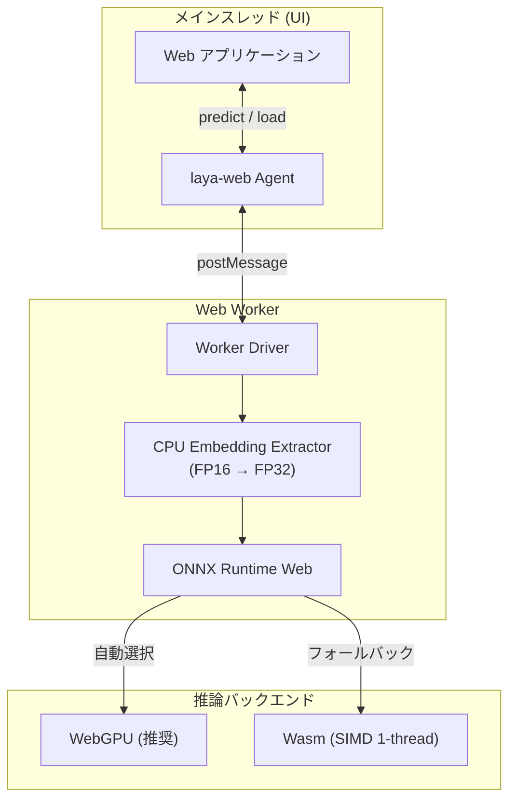

# laya-web

[](LICENSE)
[](https://r4ai.github.io/hello-jev/)

**`laya-web`** は、[Laya-MLX](https://github.com/mizorewww/laya-mlx) の Decision モデルを、ONNX Runtime Web（**WebGPU / Wasm**）を用いて**ブラウザ内で完全ローカル実行**する TypeScript ライブラリです。

一般的な LLM のような長文テキスト生成ではなく、入力テキストに対する**単一選択 (`choice`)・ルーブリック段階評価 (`score`)・命題の真偽判定 (`noul`)** などの「型付き意思決定（Typed Decisions）」を高速・軽量・高精度に返します。

👉 **[オンラインデモを今すぐ試す](https://r4ai.github.io/hello-jev/)**

---

## ✨ 主な特徴

- 🔒 **完全ブラウザ完結・サーバーレス**: 外部 API や推論サーバーは一切不要。プライバシーを保護し、API 通信コストやレート制限を気にせず利用できます。
- ⚡ **Web Worker によるスムーズな UI**: 推論処理は Web Worker 内で実行されるため、重いモデル計算中も画面のレンダリングやユーザー操作を妨げません。
- 🚀 **WebGPU / Wasm の自動切り替え**: WebGPU に対応した環境では GPU 高速化を利用し、非対応環境では Wasm へ自動フォールバックします。
- 🎯 **確信度（Confidence）付きの型付き出力**: 予測結果とともにエントロピーベースの確信度を出力するため、信頼性に応じた条件分岐や判定処理が容易です。

---

## 🏗 アーキテクチャ概要

`laya-web` は、メインスレッド（UI）の快適さを維持しながらブラウザのハードウェアリソースを最大限に活用します。



> [!NOTE]
> 多言語モデルの巨大な埋め込み表は WebGPU のメモリ制限を超えるため、**FP16 埋め込み表 (`embeddings.f16.bin`)** を分離し、必要な行のみ CPU で抽出して ONNX へ渡す最適化を行っています。

---

## 📦 クイックツアー（ライブラリの使い方）

フレームワークを問わず、任意の Web アプリケーション（React, Vue, SolidJS, Vanilla JS 等）に組み込めます。

### コード例

```ts
import { load } from "laya-web";

// 1. モデルとランタイムのロード
const agent = await load({
  modelUrl: "/models/laya/",
  backend: "auto", // 'webgpu' | 'wasm' | 'auto'
  wasmPaths: "/ort/",
  onProgress: (progress) => console.log("ロード進捗:", progress),
});

try {
  // 2. テキストと質問の定義
  const result = await agent.predict(
    "料金が二重に請求されています。返金してください。",
    {
      // 質問 1: 単一選択 (choice)
      department: {
        type: "choice",
        instructions: "この問い合わせを担当する部署は？",
        criteria: ["請求・返金", "技術サポート", "営業"],
      },
      // 質問 2: 段階評価 (score)
      urgency: {
        type: "score",
        instructions: "どの程度急いで対応すべきですか？",
        criteria: ["通常", "早め", "緊急"],
      },
      // 質問 3: 二値判定 (noul)
      refund: {
        type: "noul",
        instructions: "顧客は返金を求めていますか？",
      },
    }
  );

  console.log("使用バックエンド:", agent.backend);
  console.log("部署の判定:", result.answers.department.value);
  console.log("確信度:", result.answers.department.confidence);
} finally {
  // 3. リソースの解放
  await agent.dispose();
}
```

### 対応する質問タイプ

| タイプ | 概要 | `criteria` の指定 | 返り値の性質 |
| :--- | :--- | :--- | :--- |
| **`choice`** | 単一選択 | ラベル配列 または `{ ラベル: 説明 }` | 各ラベルの選択確率および最尤選択 |
| **`score`** | ルーブリック評価 | レベル名の配列 | `0` 始まりのレベルインデックス期待値 |
| **`noul`** | 命題真偽 | オプションで `{ false: 説明, true: 説明 }` | 命題が真である確率 $P(\text{true})$ |

---

## 🎯 確信度（Confidence）について

各回答に含まれる `confidence` は、モデルの出力確率分布のエントロピー（偏り）から計算された指標です（0.0 〜 1.0）。

- **`choice` / `score`**: 確率が一つの選択肢に集中しているほど 1.0 に近づき、選択肢間で分散しているほど 0.0 に近づきます。
- **`noul`**: 判定の明確さ（$\max(P(\text{true}), P(\text{false}))$）を表します（範囲: 0.5 〜 1.0）。

---

## 💻 デモアプリの起動

ローカル環境でサンプルデモ（SolidJS + Vite）を起動して試すことができます。

```sh
pnpm install --frozen-lockfile
pnpm model:export
pnpm dev
```

詳細な開発環境のセットアップやモデル変換については **[開発ガイド (docs/development.md)](docs/development.md)** を参照してください。

---

## 📖 ドキュメント一覧

- **[開発ガイド (docs/development.md)](docs/development.md)**: ローカル開発手順、モデルエクスポート、各種ビルドコマンド、CI/CD 設定
- **[検証仕様と品質保証 (docs/validation.md)](docs/validation.md)**: テストアーキテクチャ、精度照合結果、トラブルシューティング

---

## 📄 ライセンス・出典

本プロジェクトは [Apache-2.0 License](LICENSE) のもとで公開されています。

- **派生元プロジェクト**: [Laya-MLX](https://github.com/mizorewww/laya-mlx)
- **使用チェックポイント**: [convaiinnovations/laya-multilingual](https://huggingface.co/convaiinnovations/laya-multilingual)
- **推論エンジン**: [ONNX Runtime Web](https://onnxruntime.ai/docs/tutorials/web/ep-webgpu.html)

詳細な著作権表示および変更点については [NOTICE](NOTICE) をご覧ください。

