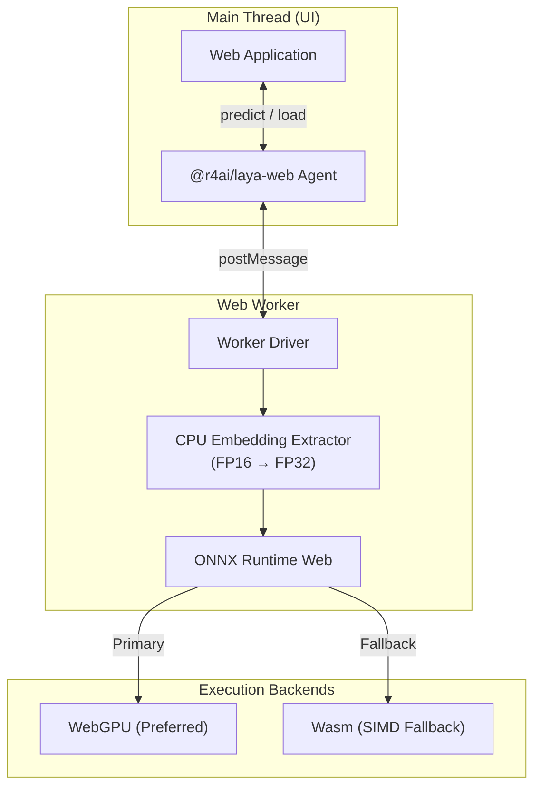

# @r4ai/laya-web

[](LICENSE)
[](https://r4ai.github.io/laya-web/)

Client-side runtime for [Laya-MLX](https://github.com/mizorewww/laya-mlx) decision models in the browser, powered by ONNX Runtime Web (WebGPU / Wasm).

Unlike general generative LLMs that output free-form text, Laya performs fast, low-footprint classification over structured decision schemas (typed decisions):

- Single-choice selection (`choice`)
- Ordinal scoring (`score`)
- Binary truth evaluation (`noul`)

[Live Demo](https://r4ai.github.io/laya-web/)

## Features

- Fully local execution
  - Zero external API dependencies
  - Total client-side data privacy
  - Zero network latency or API rate limits
- Web Worker architecture
  - Inference executes off the main thread
  - Preserves responsive 60fps UI rendering and interaction
- Hardware acceleration with automatic fallback
  - Uses WebGPU where supported
  - Falls back to single-threaded SIMD WebAssembly (Wasm) automatically
- Calibrated confidence metrics
  - Normalized entropy-based confidence score (0.0 to 1.0)
  - Clear separation between class probabilities and decision certainty
- Memory-efficient embedding lookup
  - FP16 embedding table stored in CPU memory
  - Avoids WebGPU storage buffer limits on large vocabulary matrices

## Architecture

The runtime separates UI orchestration from tensor execution through a dedicated Web Worker:



> [!NOTE]
> Multilingual vocabulary embedding tables exceed browser WebGPU storage buffer limits. `@r4ai/laya-web` stores raw FP16 embeddings (`embeddings.f16.bin`) in CPU memory, slices only active input tokens, converts them to FP32, and feeds the resulting tensor directly into the ONNX graph.

## Quickstart

### Installation

```sh
npm install @r4ai/laya-web onnxruntime-web
```

### Usage

Run inference inside a Web Worker to avoid blocking the main UI thread. Serve model assets from `/models/laya/` and matching ONNX Runtime Web binaries from `/ort/` (see [Vite configuration example](examples/minimal/vite.config.ts)).

```ts
import { load } from "@r4ai/laya-web";

// 1. Initialize runtime and load model assets
const agent = await load({
  modelUrl: "/models/laya/",
  backend: "auto", // "webgpu" | "wasm" | "auto"
  wasmPaths: "/ort/",
  onProgress: (progress) => console.log("Load progress:", progress),
});

try {
  // 2. Execute typed predictions over input text
  const result = await agent.predict(
    "I was charged twice for my subscription this month. Please issue a refund.",
    {
      department: {
        type: "choice",
        instructions: "Which support department should handle this request?",
        criteria: ["Billing & Refunds", "Technical Support", "Sales"],
      },
      urgency: {
        type: "score",
        instructions: "How urgent is this ticket?",
        criteria: ["Normal", "Elevated", "Immediate"],
      },
      refund: {
        type: "noul",
        instructions: "Does the user explicitly demand a refund?",
      },
    },
  );

  console.log("Active backend:", agent.backend);
  const department = result.answers.department;
  if (department.type === "choice") {
    console.log("Selected department:", department.choice);
  }
  console.log("Confidence:", result.answers.department.confidence);
} finally {
  // 3. Release ONNX session and memory buffers
  await agent.dispose();
}
```

## Decision Types

| Type         | Description                        | `criteria` Specification                                   | Output                                                                    |
| :----------- | :--------------------------------- | :--------------------------------------------------------- | :------------------------------------------------------------------------ |
| **`choice`** | Single-label classification        | Array of label strings, or `{ [label]: description }` map  | Predicted label (`choice`) and probability distribution (`probabilities`) |
| **`score`**  | Ordinal evaluation on rubric scale | Array of level descriptions (0-indexed)                    | Expected level score (`score`), level distribution, and criteria mapping  |
| **`noul`**   | Binary proposition verification    | Optional `{ false?: description, true?: description }` map | Probability that proposition holds (`noul` as $P(\text{true})$)           |

## Confidence Calibration

The `confidence` value returned in each answer is a normalized metric in the range `[0.0, 1.0]`, derived from output distribution entropy:

$$H(P) = -\sum_{i=1}^{K} P(i) \ln P(i)$$

$$\text{confidence} = \max\left(0, 1 - \frac{H(P)}{\ln K}\right)$$

Metric behavior differs by question type:

- **`choice` and `score`**
  - Evaluated against option count $K$
  - Approaches 1.0 when probabilities concentrate on a single candidate
  - Approaches 0.0 when predictions disperse uniformly across choices
- **`noul`**
  - Evaluates classification margin $\max(P(\text{true}), P(\text{false}))$
  - Values span `[0.5, 1.0]` where 0.5 denotes total ambiguity

## Local Demo

To launch the SolidJS demo application locally:

```sh
pnpm install --frozen-lockfile
pnpm model:export
pnpm dev
```

Open `http://127.0.0.1:5173/` in your browser.

For complete setup and model conversion instructions, see the [Development Guide](docs/development.md).

## Documentation

- [Development Guide](docs/development.md): Environment setup, model export, build commands, and CI/CD pipelines
- [Validation & QA Specification](docs/validation.md): Test architecture, parity verification, benchmarks, and troubleshooting

## License & Attribution

Distributed under the [Apache-2.0 License](LICENSE).

- **Upstream Project**: [Laya-MLX](https://github.com/mizorewww/laya-mlx)
- **Base Checkpoint**: [convaiinnovations/laya-multilingual](https://huggingface.co/convaiinnovations/laya-multilingual)
- **Inference Engine**: [ONNX Runtime Web](https://onnxruntime.ai/docs/tutorials/web/ep-webgpu.html)

For copyright notices and attribution statements, see [NOTICE](NOTICE).
