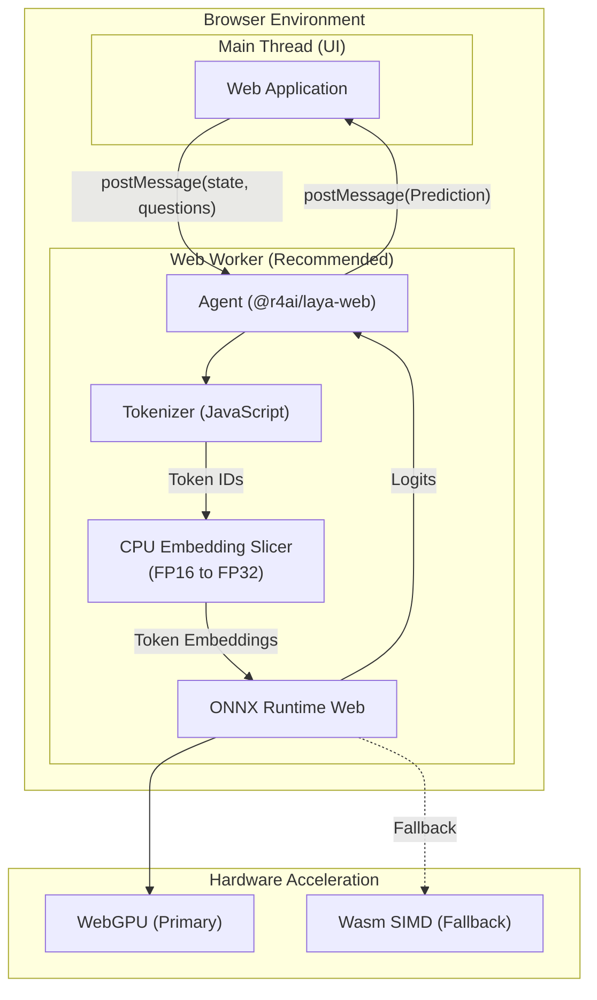

# @r4ai/laya-web

[](LICENSE)
[](https://r4ai.github.io/laya-web/)
[](https://www.npmjs.com/package/@r4ai/laya-web)

Client-side inference runtime for [Laya-MLX](https://github.com/mizorewww/laya-mlx) decision models in the browser, powered by ONNX Runtime Web (WebGPU and WebAssembly SIMD).

Laya evaluates structured decisions (**typed decisions**) directly over input state or text without generating free-form text:

- **Categorical Choice (`choice`)**: Selects the best option from discrete candidate labels
- **Ordinal Scoring (`score`)**: Evaluates input against an ordered rubric or severity scale
- **Proposition Verification (`noul`)**: Computes the probability that a statement holds true

[Live Demo](https://r4ai.github.io/laya-web/)

## Key Features

- **100% Client-Side Inference**: Evaluates decisions entirely in the browser without sending input data to external servers
- **Web Worker Compatible**: Runs smoothly in dedicated Web Workers to keep the UI thread responsive at 60fps
- **WebGPU with Wasm Fallback**: WebGPU hardware acceleration with automatic fallback to single-threaded SIMD WebAssembly
- **CPU Embedding Slicing**: Slices FP16 embeddings on the CPU to bypass browser WebGPU storage buffer limits on large vocabularies (>128k tokens)
- **Calibrated Decision Confidence**: Computes normalized Shannon entropy ($0.0$ to $1.0$) for reliable uncertainty filtering

## Architecture

The library runs in both main threads and Web Workers. Hosting the agent inside a dedicated Web Worker isolates heavy tensor computation from the UI:



## Installation

```sh
npm install @r4ai/laya-web onnxruntime-web
# or
pnpm add @r4ai/laya-web onnxruntime-web
# or
yarn add @r4ai/laya-web onnxruntime-web
```

## Quickstart

Run inference inside a Web Worker to keep the UI thread responsive. Serve model assets and ONNX Runtime Web Wasm binaries from your static file server (see the [Vite example](https://github.com/r4ai/laya-web/blob/main/examples/minimal/vite.config.ts)).

```ts
import { load } from "@r4ai/laya-web";

// 1. Initialize runtime and load model assets
const agent = await load({
  modelUrl: "/models/laya/",
  backend: "auto", // "webgpu" | "wasm" | "auto"
  wasmPaths: "/ort/",
  onProgress: (progress) => console.log("Load progress:", progress),
});

try {
  // 2. Evaluate typed decisions over input context
  const result = await agent.predict(
    "I was charged twice for my subscription this month. Please issue a refund.",
    {
      department: {
        type: "choice",
        instructions: "Which support department should handle this request?",
        criteria: ["Billing & Refunds", "Technical Support", "Sales"],
      },
      urgency: {
        type: "score",
        instructions: "How urgent is this ticket?",
        criteria: ["Normal", "Elevated", "Immediate"],
      },
      refund_requested: {
        type: "noul",
        instructions: "Does the user explicitly demand a refund?",
      },
    },
  );

  console.log("Active backend:", agent.backend);

  // Inspect categorical choice
  const department = result.answers.department;
  if (department.type === "choice") {
    console.log("Department:", department.choice);
    console.log("Probabilities:", department.probabilities);
    console.log("Confidence:", department.confidence);
  }

  // Inspect ordinal score
  const urgency = result.answers.urgency;
  if (urgency.type === "score") {
    console.log("Urgency score:", urgency.score);
    console.log("Score legend:", urgency.legend);
  }

  // Inspect binary verification
  const refund = result.answers.refund_requested;
  if (refund.type === "noul") {
    console.log("P(True):", refund.noul);
    console.log("Confidence:", refund.confidence);
  }
} finally {
  // 3. Release ONNX sessions and memory buffers
  await agent.dispose();
}
```

## Decision Types

| Type         | Target Task                   | `criteria` Schema                                                    | Output Structure                                                                                 |
| :----------- | :---------------------------- | :------------------------------------------------------------------- | :----------------------------------------------------------------------------------------------- |
| **`choice`** | Categorical classification    | String array `["A", "B"]` or dictionary `{ [label]: "description" }` | Selected label (`choice`), per-label distribution (`probabilities`), and `confidence`            |
| **`score`**  | Ordinal grading on a rubric   | Ordered array of level criteria `["low", "medium", "high"]`          | Expected score (`score` as a float), level mapping (`legend`), `probabilities`, and `confidence` |
| **`noul`**   | Binary statement verification | Optional `{ false?: "description", true?: "description" }`           | Probability of truth (`noul` as $P(\text{true})$) and decision `confidence`                      |

## Confidence Calibration

Every answer returns a normalized `confidence` value in $[0.0, 1.0]$ representing probability concentration rather than ground-truth correctness. Computation depends on question type:

### Categorical Choice & Ordinal Score (`choice`, `score`)

- **Single Option ($K < 2$)**: Returns fixed `1.0`
- **Multiple Options ($K \ge 2$)**: Normalized Shannon entropy over option count $K$

$$H(P) = -\sum_{i=1}^{K} P(i) \ln P(i)$$

$$\text{confidence} = \max\left(0, \min\left(1, 1 - \frac{H(P)}{\ln K}\right)\right)$$

- Yields $1.0$ when probability concentrates entirely on a single option
- Scales down to $0.0$ when probability distributes uniformly across all options

### Binary Verification (`noul`)

Evaluated as the binary classification margin over calibrated probabilities:

$$\text{confidence} = \max(P(\text{true}), 1 - P(\text{true}))$$

- Range spans $[0.5, 1.0]$
- $0.5$ represents maximum ambiguity (equal probability)
- $1.0$ represents probability concentrated entirely on one outcome

> [!NOTE]
> `confidence` measures probability distribution sharpness. It does not guarantee prediction correctness or ground-truth accuracy.

## Model Assets & Hosting

Deploy the following files under your static `modelUrl` directory:

| File                 | Approximate Size | Purpose                                                                |
| :------------------- | :--------------- | :--------------------------------------------------------------------- |
| `config.json`        | ~1.1 KB          | Architecture parameters, calibration temperatures, and SHA-256 digests |
| `model.onnx`         | ~5.37 MB         | ONNX computation graph structure without weights                       |
| `model.onnx.data`    | ~501.20 MB       | External model weights downloaded upfront for ONNX Runtime Web         |
| `embeddings.f16.bin` | ~393.22 MB       | Raw FP16 token embedding table read by CPU memory                      |
| `tokenizer/`         | ~34.36 MB        | Hugging Face tokenizer configuration and vocabulary files              |

Export these files locally from the pinned checkpoint:

```sh
pnpm install --frozen-lockfile
pnpm model:export
```

## Local Development & Demo

To launch the SolidJS demo application locally:

```sh
pnpm install --frozen-lockfile
pnpm model:export
pnpm dev
```

Open `http://127.0.0.1:5173/` in your browser.

## Documentation

- [Development Guide](docs/development.md): Environment setup, model export pipeline, build commands, and CI/CD workflows
- [Validation Specification](docs/validation.md): Verification layers, numerical parity benchmarks, and hardware edge cases

## License & Attribution

Distributed under the [Apache-2.0 License](LICENSE).

- **Upstream Project**: [Laya-MLX](https://github.com/mizorewww/laya-mlx)
- **Base Checkpoint**: [convaiinnovations/laya-multilingual](https://huggingface.co/convaiinnovations/laya-multilingual)
- **Inference Runtime**: [ONNX Runtime Web](https://onnxruntime.ai/docs/tutorials/web/ep-webgpu.html)

See [NOTICE](NOTICE) for copyright notices and third-party attributions.
