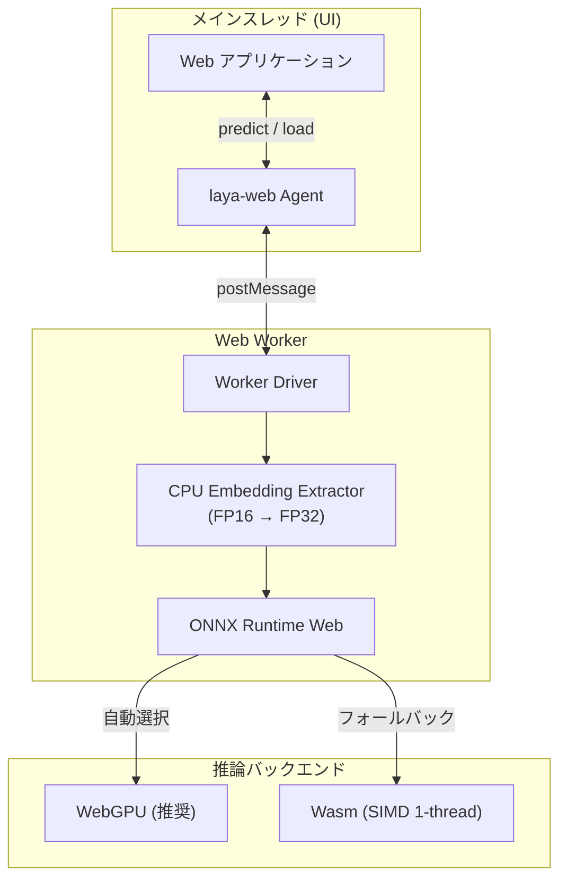

# laya-web

[](LICENSE)
[](https://r4ai.github.io/hello-jev/)

[Laya-MLX](https://github.com/mizorewww/laya-mlx) の Decision モデルを ONNX Runtime Web（WebGPU / Wasm）でブラウザ内ローカル実行する TypeScript ライブラリ。

LLMのような長文生成を行わず、入力テキストに対する単一選択（`choice`）・段階評価（`score`）・二値判定（`noul`）などの型付き意思決定（Typed Decisions）を高速・軽量に処理する。

👉 [オンラインデモ](https://r4ai.github.io/hello-jev/)

## 特徴

- 🔒 **完全ローカル・サーバーレス実行**
  - 外部 API や推論サーバー不要
  - データのプライバシーを保護
  - 通信コストや API レート制限を回避
- ⚡ **Web Worker による快適な UI**
  - 推論処理をバックグラウンドで実行
  - メインスレッドの描画やユーザー操作を阻害しない設計
- 🚀 **WebGPU / Wasm の自動選択**
  - 対応環境では WebGPU で高速化
  - 非対応環境では Wasm へ自動フォールバック
- 🎯 **確信度（Confidence）付きの型付き出力**
  - 予測値と同時にエントロピーベースの確信度を算出
  - 信頼度に応じた条件分岐が容易

## アーキテクチャ

メインスレッドの応答性を保ちつつ、ブラウザのハードウェアリソースを最大限活用する構成をとる。



> [!NOTE]
> 多言語モデルの巨大な埋め込み表は WebGPU のメモリ上限を超えるため、FP16 埋め込み表 (`embeddings.f16.bin`) を分離し、必要な行のみ CPU で抽出して ONNX へ渡す設計を採用している。

## クイックツアー

React、Vue、SolidJS、Vanilla JS など任意のフロントエンド環境で利用可能。

### 基本的な使い方

```ts
import { load } from "laya-web";

// 1. モデルとランタイムのロード
const agent = await load({
  modelUrl: "/models/laya/",
  backend: "auto", // 'webgpu' | 'wasm' | 'auto'
  wasmPaths: "/ort/",
  onProgress: (progress) => console.log("ロード進捗:", progress),
});

try {
  // 2. 予測の実行
  const result = await agent.predict(
    "料金が二重に請求されています。返金してください。",
    {
      // 質問 1: 単一選択 (choice)
      department: {
        type: "choice",
        instructions: "この問い合わせを担当する部署は？",
        criteria: ["請求・返金", "技術サポート", "営業"],
      },
      // 質問 2: 段階評価 (score)
      urgency: {
        type: "score",
        instructions: "どの程度急いで対応すべきですか？",
        criteria: ["通常", "早め", "緊急"],
      },
      // 質問 3: 二値判定 (noul)
      refund: {
        type: "noul",
        instructions: "顧客は返金を求めていますか？",
      },
    }
  );

  console.log("使用バックエンド:", agent.backend);
  console.log("部署の判定:", result.answers.department.value);
  console.log("確信度:", result.answers.department.confidence);
} finally {
  // 3. リソースの解放
  await agent.dispose();
}
```

### 対応する判定タイプ

| タイプ | 概要 | `criteria` の指定 | 返り値の性質 |
| :--- | :--- | :--- | :--- |
| **`choice`** | 単一選択 | ラベル配列 または `{ ラベル: 説明 }` | 各ラベルの選択確率および最尤ラベル |
| **`score`** | ルーブリック評価 | レベル名の配列 | `0` 始まりのレベルインデックス期待値 |
| **`noul`** | 命題真偽判定 | オプションで `{ false: 説明, true: 説明 }` | 命題が真である確率 $P(\text{true})$ |

## 確信度（Confidence）の定義

回答に含まれる `confidence` は、出力確率分布のエントロピー（偏り）から算出した 0.0 〜 1.0 の指標である。

- **`choice` / `score`**
  - 確率が一つの選択肢に集中するほど 1.0 に接近
  - 確率が選択肢間で分散するほど 0.0 に接近
- **`noul`**
  - 判定の明確さ（$\max(P(\text{true}), P(\text{false}))$）を表現（範囲: 0.5 〜 1.0）

## デモアプリの起動

ローカル環境でサンプルデモ（SolidJS + Vite）を起動するコマンド。

```sh
pnpm install --frozen-lockfile
pnpm model:export
pnpm dev
```

セットアップの詳細やモデル変換については [開発ガイド](docs/development.md) を参照。

## ドキュメント一覧

- [開発ガイド](docs/development.md): ローカル開発手順、モデルエクスポート、ビルドコマンド、CI/CD 設定
- [検証仕様と品質保証ガイド](docs/validation.md): テストアーキテクチャ、精度照合結果、トラブルシューティング

## ライセンス・出典

本プロジェクトは [Apache-2.0 License](LICENSE) のもとで公開されている。

- **派生元プロジェクト**: [Laya-MLX](https://github.com/mizorewww/laya-mlx)
- **使用チェックポイント**: [convaiinnovations/laya-multilingual](https://huggingface.co/convaiinnovations/laya-multilingual)
- **推論エンジン**: [ONNX Runtime Web](https://onnxruntime.ai/docs/tutorials/web/ep-webgpu.html)

著作権表示および変更点の詳細は [NOTICE](NOTICE) を参照。
