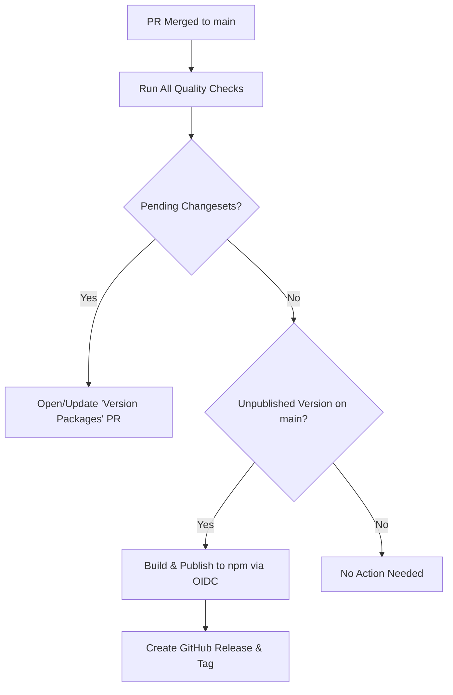

# Development Guide

Practical guide for developing, testing, exporting models, and contributing to `@r4ai/laya-web`.

---

## Prerequisites & Toolchain

Ensure the following tools are installed in your environment:

- **Node.js**: `24.x` (matching the CI environment)
- **pnpm**: `v11.x` (package manager)
- **uv**: [`uv`](https://docs.astral.sh/uv/) (Python package and virtual environment manager)

> [!NOTE]
> An Apple Silicon Mac is required **only** if you need to run `pnpm model:verify` against the native Apple MLX reference implementation. Model export (`pnpm model:export`), PyTorch parity tests (`uv run pytest`), and all browser development run across all standard operating systems and CPU architectures.

---

## Repository Layout

```
.
├── src/                  # Library source code (@r4ai/laya-web)
│   ├── index.ts          # Public entrypoint
│   ├── runtime.ts        # ONNX Runtime Web session initialization and execution
│   ├── agent.ts          # Agent state, queue serialization, and disposal lifecycle
│   ├── core.ts           # Question schema validation, token budgeting, and scoring
│   ├── assets.ts         # Parallel asset download manager and tokenizer wrapper
│   └── types.ts          # TypeScript type definitions
├── examples/minimal/     # SolidJS browser demonstration application
├── scripts/              # Build, export, and deployment validation scripts
│   ├── export_model.py   # Hugging Face to partitioned ONNX & FP16 exporter
│   ├── verify_model.py   # Ground-truth parity verification against MLX FP32
│   └── validate-pages.mjs# Pre-deployment artifact and size integrity checker
├── tests/                # Test suites (Vitest, Python, browser harness)
└── docs/                 # Engineering documentation
```

---

## Getting Started

Follow these steps to set up your local development environment:

```sh
# 1. Clone repository and install dependencies
git clone https://github.com/r4ai/laya-web.git
cd laya-web
pnpm install --frozen-lockfile

# 2. Export the default model checkpoint (required on initial setup)
pnpm model:export

# 3. Start the local development server
pnpm dev
```

Open `http://127.0.0.1:5173/` in your browser to inspect the application.

---

## Command Reference

### Development & Quality Assurance

| Command             | Action                                                           |
| :------------------ | :--------------------------------------------------------------- |
| `pnpm dev`          | Build the library and start the Vite dev server with hot reload  |
| `pnpm lint`         | Run oxlint over JavaScript and TypeScript (fails on any warning) |
| `pnpm lint:fix`     | Apply automatic oxlint fixes                                     |
| `pnpm format:check` | Check code formatting with oxfmt                                 |
| `pnpm format`       | Auto-format source code, configurations, and documentation       |
| `pnpm typecheck`    | Run the TypeScript compiler without emitting files               |
| `pnpm test`         | Run Vitest unit and integration suites with V8 coverage          |
| `uv run pytest`     | Verify numerical logit parity between PyTorch and ONNX           |
| `pnpm model:verify` | Benchmark exported ONNX outputs against Apple MLX FP32 reference |
| `pnpm test:browser` | Launch the browser test harness for WebGPU / Wasm parity checks  |

### Build & Distribution

| Command            | Action                                                               |
| :----------------- | :------------------------------------------------------------------- |
| `pnpm build`       | Bundle library into `dist/` with ESM output and `.d.ts` declarations |
| `pnpm build:demo`  | Build the standalone SolidJS demo application                        |
| `pnpm build:pages` | Build the demo and validate all assets with `validate-pages.mjs`     |
| `pnpm pack`        | Create an npm `.tgz` archive to verify packaged contents             |

---

## Model Export Pipeline

The export script ([`scripts/export_model.py`](../scripts/export_model.py)) converts Hugging Face Laya checkpoints into partitioned assets tailored for browser streaming.

### Default Checkpoint Specification

- **Hugging Face Model ID**: `convaiinnovations/laya-multilingual`
- **Pinned Git Revision**: `052592a15d198d9ad47da779604259b10b47b7aa`
- **Original Download Size**: ~644 MB
- **Exported Output Directory**: `examples/minimal/public/models/laya/` (~934 MB total)

### Generated Artifacts

```
models/laya/
├── config.json                 # Architecture parameters, calibration, and SHA-256 hashes
├── model.onnx                  # ONNX computation graph structure (external data format)
├── model.onnx.data             # Model weights loaded on demand (~684 MB)
├── embeddings.f16.bin          # Raw FP16 token embedding table (~248 MB)
└── tokenizer/                  # Hugging Face tokenizer files
    ├── tokenizer.json
    └── tokenizer_config.json
```

### Custom Export

The script guards against accidental overwrites by aborting if the target directory already exists. To export to a custom path or evaluate an alternative ModernBERT checkpoint:

```sh
uv run python scripts/export_model.py \
  --output /path/to/custom-directory \
  --source convaiinnovations/laya-multilingual \
  --revision 052592a15d198d9ad47da779604259b10b47b7aa
```

---

## Continuous Integration

The main CI workflow (`.github/workflows/ci.yml`) runs on pull requests and pushes to `main`. It enforces strict quality gates:

1. **Static Analysis**: `oxlint` (zero warnings allowed), `oxfmt` formatting verification, and `tsc --noEmit`.
2. **JavaScript Tests**: Vitest suite with V8 code coverage reporting.
3. **Python Verification**: PyTorch vs ONNX logit parity checks (`uv run --frozen pytest`).
4. **Build & Package Audit**: Full library compilation and inspection of packaged artifacts.

> [!NOTE]
> Clean CI PR runners do not maintain the 1 GB model weights in cache, so model-dependent tokenizer tests are skipped if fixtures are absent. The GitHub Pages deployment workflow exports the pinned model first and executes complete fixture-backed validation.

---

## GitHub Pages Deployment

The demo site is automatically validated and deployed to GitHub Pages on every push to `main` (`.github/workflows/pages.yml`).

Before deployment, [`scripts/validate-pages.mjs`](../scripts/validate-pages.mjs) validates release integrity:

1. **Required Assets**: Verifies presence and non-zero size of `index.html`, `LICENSE`, `NOTICE`, and ONNX Runtime Wasm modules.
2. **Model Integrity**: Computes SHA-256 hashes of all exported model files and verifies them against `config.json`.
3. **Size Budget**: Confirms total distribution size does not exceed the 1,000,000,000 bytes (1 GB) budget.
4. **Wasm Dependencies**: Scans bundled JavaScript output to ensure all referenced ONNX Runtime Wasm and worker files exist under `ort/`.

To test the full Pages build and validation pipeline locally:

```sh
pnpm build:pages
```

---

## Releases & Versioning

We manage version bumps and changelogs using [Changesets](https://github.com/changesets/changesets) and publish to npm using GitHub Actions **OpenID Connect (OIDC) Trusted Publishing**.

### Creating a Changeset

When submitting a user-facing change:

```sh
pnpm changeset
```

1. Select `@r4ai/laya-web`.
2. Choose the appropriate semver bump (`major`, `minor`, `patch`).
3. Enter a concise summary of the change.
4. Commit the generated markdown file under `.changeset/` with your PR.

> Tooling, test, or documentation-only changes that do not affect the published package do not require a changeset.

### Automated Release Flow

When a pull request with a changeset merges into `main`, `.github/workflows/release.yml` triggers:



### Initial Registry & OIDC Setup

For maintainers configuring npm trusted publishing for the first time:

1. **Bootstrap Initial Version**: If `@r4ai/laya-web` has never been published, publish the initial version once manually using `npm login` and `npm publish --access public`. Subsequent releases use OIDC.
2. **Configure Trusted Publisher on npmjs.com**:
   In package settings, add a GitHub Actions trusted publisher with the following values:
   - **Organization or user**: `r4ai`
   - **Repository**: `laya-web`
   - **Workflow filename**: `release.yml`
   - **Environment name**: `npm`
3. **GitHub Environment**: Create a GitHub repository environment named `npm` and restrict deployments to the `main` branch.
4. **Workflow Permissions**: In GitHub repository **Settings → Actions → General**, ensure **Allow GitHub Actions to create and approve pull requests** is enabled.

---

## Related Documents

- [README.md](../README.md): Project overview, architecture, and quickstart guide.
- [Validation Specification](validation.md): Verification layers, numerical tolerances, and benchmarks.
