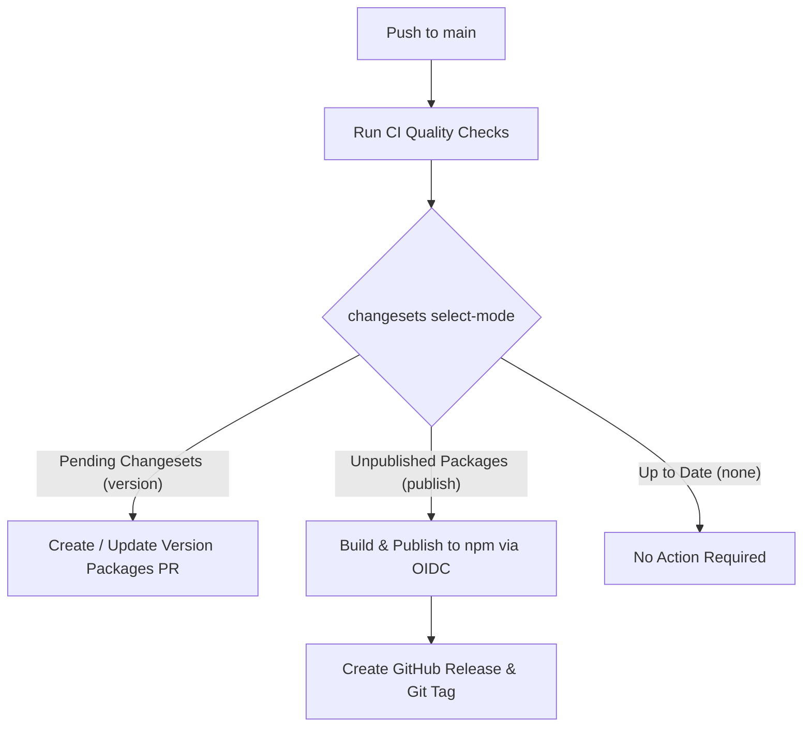

# Development Guide

Guide for building, testing, exporting models, and contributing to `@r4ai/laya-web`.

## Prerequisites & Toolchain

Required tooling:

- **Node.js**: `24.x` (matches CI environment)
- **pnpm**: `v11.x` (package manager)
- **uv**: [`uv`](https://docs.astral.sh/uv/) (Python package and virtual environment manager)

> [!NOTE]
> An Apple Silicon Mac is required **only** for `pnpm model:verify` against the native Apple MLX reference implementation. Model export (`pnpm model:export`), PyTorch parity tests (`uv run pytest`), and browser development run on all standard operating systems and CPU architectures.

## Repository Layout

```
.
├── src/                  # Library source code (@r4ai/laya-web)
│   ├── index.ts          # Public entrypoint
│   ├── runtime.ts        # ONNX Runtime Web session initialization and execution
│   ├── agent.ts          # Agent state, queue serialization, and disposal lifecycle
│   ├── core.ts           # Question schema validation, token budgeting, and scoring
│   ├── assets.ts         # Parallel asset download manager and tokenizer wrapper
│   └── types.ts          # TypeScript type definitions
├── examples/minimal/     # SolidJS browser demonstration application
├── scripts/              # Build, export, and deployment validation scripts
│   ├── export_model.py   # Hugging Face to partitioned ONNX & FP16 exporter
│   ├── verify_model.py   # Ground-truth parity verification against MLX FP32
│   └── validate-pages.mjs# Pre-deployment asset and size integrity checker
├── tests/                # Test suites (Vitest, Python, browser harness)
└── docs/                 # Engineering documentation
```

## Getting Started

Set up the local environment and launch the development server:

```sh
# 1. Clone repository and install dependencies
git clone https://github.com/r4ai/laya-web.git
cd laya-web
pnpm install --frozen-lockfile

# 2. Export default model checkpoint (required on initial setup)
pnpm model:export

# 3. Start local development server
pnpm dev
```

Open `http://127.0.0.1:5173/` in your browser to inspect the application.

## Command Reference

### Development & Quality Assurance

| Command             | Description                                                                                |
| :------------------ | :----------------------------------------------------------------------------------------- |
| `pnpm dev`          | Build library and start Vite dev server with hot reload                                    |
| `pnpm lint`         | Run oxlint over JavaScript and TypeScript (fails on any warning)                           |
| `pnpm lint:fix`     | Apply automatic oxlint fixes                                                               |
| `pnpm format:check` | Check code and documentation formatting with oxfmt                                         |
| `pnpm format`       | Auto-format source code, configurations, and documentation                                 |
| `pnpm typecheck`    | Run TypeScript compiler without emitting files                                             |
| `pnpm test`         | Run Vitest unit and integration suites with V8 coverage                                    |
| `uv run pytest`     | Verify numerical logit parity between PyTorch and ONNX                                     |
| `pnpm model:verify` | Benchmark exported ONNX outputs against Apple MLX FP32 reference (generates `parity.json`) |
| `pnpm test:browser` | Start local HTTP server (`:5174`) for browser WebGPU and Wasm parity checks                |

### Build & Packaging

| Command            | Description                                                          |
| :----------------- | :------------------------------------------------------------------- |
| `pnpm build`       | Bundle library into `dist/` with ESM output and `.d.ts` declarations |
| `pnpm build:demo`  | Build standalone SolidJS demo application                            |
| `pnpm build:pages` | Build demo and validate all assets with `validate-pages.mjs`         |
| `pnpm pack`        | Create npm `.tgz` archive to inspect package contents                |

## Model Export Pipeline

The export script ([`scripts/export_model.py`](https://github.com/r4ai/laya-web/blob/main/scripts/export_model.py)) converts Hugging Face checkpoints into partitioned browser assets.

### Default Checkpoint Specification

- **Hugging Face Model ID**: `convaiinnovations/laya-multilingual`
- **Pinned Git Revision**: `052592a15d198d9ad47da779604259b10b47b7aa`
- **Original Download Size**: ~644 MB
- **Exported Output Directory**: `examples/minimal/public/models/laya/` (~934 MB total)

### Generated Artifacts

```
models/laya/
├── config.json                 # Architecture parameters, calibration, and SHA-256 hashes
├── model.onnx                  # ONNX computation graph structure (~5.37 MB)
├── model.onnx.data             # External model weights downloaded upfront (~501.20 MB)
├── embeddings.f16.bin          # Raw FP16 token embedding table (~393.22 MB)
└── tokenizer/                  # Hugging Face tokenizer files (~34.36 MB)
    ├── tokenizer.json
    └── tokenizer_config.json
```

### Custom Export

The script prevents overwriting existing directories. Pass a custom destination directory or an alternate checkpoint via CLI options:

```sh
uv run python scripts/export_model.py \
  --output /path/to/custom-directory \
  --source convaiinnovations/laya-multilingual \
  --revision 052592a15d198d9ad47da779604259b10b47b7aa
```

## Browser Parity Validation

Hardware validation directly compares browser execution against Apple MLX FP32 CPU outputs:

1. **Generate Reference Fixtures (Apple Silicon)**
   Execute the MLX CPU reference benchmark to produce `examples/minimal/public/models/laya/parity.json`:

   ```sh
   pnpm model:verify
   ```

2. **Launch Local Test Server**
   Start the browser test server on port 5174:

   ```sh
   pnpm test:browser
   ```

3. **Execute Parity Suite in Browser**
   - Navigate to `http://127.0.0.1:5174/` in Chromium
   - Choose execution backend (`webgpu` or `wasm`) from the dropdown
   - Click **Run parity suite**
   - Confirm all 9 fixtures pass token parity and numerical tolerances ($\le 0.000101$)

## Continuous Integration

The primary CI workflow (`.github/workflows/ci.yml`) runs on pull requests and pushes to `main`. It enforces four quality gates:

- **Static Analysis**
  - `oxlint` with zero allowed warnings
  - `oxfmt` formatting verification
  - `tsc --noEmit` type checking
- **JavaScript Tests**
  - Vitest suite with V8 code coverage reporting
- **Python Parity**
  - PyTorch vs ONNX logit parity checks (`uv run --frozen pytest`)
- **Package Audit**
  - Full library build and package content inspection

> [!NOTE]
> CI PR runners do not cache the ~1 GB model weights. Model-dependent tokenizer tests skip automatically when fixtures are absent. The GitHub Pages deployment workflow exports the pinned model first and executes complete validation.

## GitHub Pages Deployment

The demo site deploys automatically to GitHub Pages on every push to `main` (`.github/workflows/pages.yml`).

Before deployment, [`scripts/validate-pages.mjs`](https://github.com/r4ai/laya-web/blob/main/scripts/validate-pages.mjs) verifies distribution integrity:

- **Asset Presence**: Ensures `index.html`, `LICENSE`, `NOTICE`, and ONNX Runtime Wasm modules exist and are non-empty
- **Model Checksums**: Recomputes SHA-256 hashes for all model files and matches them against `config.json`
- **Size Budget**: Enforces that total deployed site size stays under 1,000,000,000 bytes (1 GB)
- **Wasm Runtime Dependencies**: Scans bundled JavaScript to verify that all referenced ONNX Runtime Wasm and worker files exist under `ort/`

Run the complete Pages build and validation pipeline locally:

```sh
pnpm build:pages
```

## Releases & Versioning

Releases follow semantic versioning via [Changesets](https://github.com/changesets/changesets) and publish to npm through GitHub Actions **OpenID Connect (OIDC) Trusted Publishing**.

### Creating a Changeset

When submitting a user-facing change:

```sh
pnpm changeset
```

1. Select `@r4ai/laya-web`
2. Choose the semver bump type (`major`, `minor`, or `patch`)
3. Enter a concise summary of the change
4. Commit the generated `.changeset/*.md` file with your pull request

> [!NOTE]
> Tooling, test, and documentation changes do not require a changeset.

### Automated Release Flow

Pushes to `main` trigger `.github/workflows/release.yml`. The workflow uses `changesets/action/select-mode` to determine whether to update the version PR or publish packages:



### Initial Registry & OIDC Setup

For maintainers configuring npm trusted publishing:

1. **Bootstrap Initial Version**
   - If `@r4ai/laya-web` has never been published, publish the initial version once manually using `npm login` and `npm publish --access public`
   - Subsequent releases publish automatically via OIDC
2. **Configure Trusted Publisher on npmjs.com**
   - Under package settings, add a GitHub Actions trusted publisher with:
     - **Organization or user**: `r4ai`
     - **Repository**: `laya-web`
     - **Workflow filename**: `release.yml`
     - **Environment name**: `npm`
3. **Configure GitHub Environment**
   - Create a repository environment named `npm`
   - Restrict deployments to the `main` branch
4. **Configure Workflow Permissions**
   - Under **Settings → Actions → General**, enable **Allow GitHub Actions to create and approve pull requests**

## Related Documents

- [README.md](../README.md): Project overview, architecture, and quickstart guide
- [Validation Specification](validation.md): Verification layers, numerical tolerances, and benchmarks
