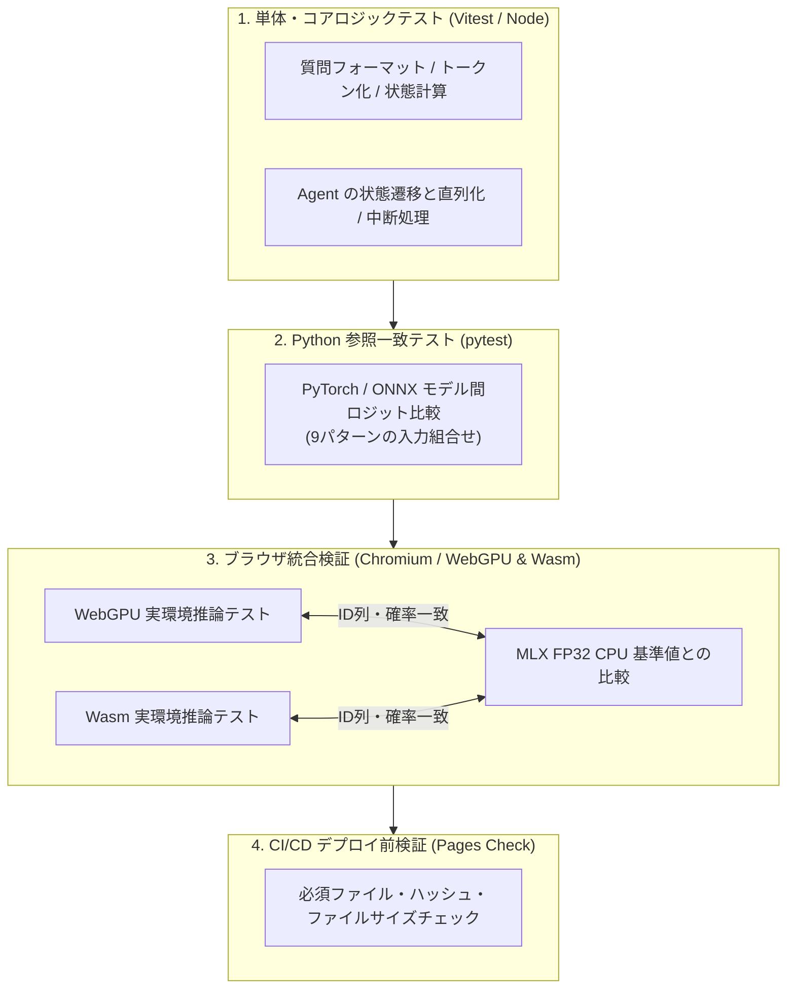

# 検証仕様と品質保証ガイド

`@r4ai/laya-web` の推論精度、状態管理、ブラウザ動作およびデプロイ時の品質保証（QA）に関するテストアーキテクチャと検証基準。

## 検証アーキテクチャ

単体テストからブラウザ実機検証、CI/CD での静的資産検証まで、4つの階層で多角的なテストを実施する。



## 検証マトリクス

### 1. コアロジック & Agent 状態管理

| 対象 | 入力条件・シナリオ | 期待される動作 | テスト実行層 |
| :--- | :--- | :--- | :--- |
| **質問バリデーション** | `choice` / `score` / `noul` の正しい指定 | 互換プレフィックス、マーカー、型 ID の正確な構築 | Core 単体 + 実モデル |
| **不正入力** | 空の選択肢、重複ラベル、未対応タイプ | 推論実行前に拒否（`predict()` はPromiseのreject） | Core / Agent 単体 |
| **コンテキスト長** | 1,024 トークンを超える長文 | 選択肢と終端タグを保持し、本文末尾のみ適切に切詰 | Core 単体 + 実モデル |
| **長文オーバーフロー** | 選択肢自体がコンテキスト枠に収まらない | 明示的なオーバーフローエラーの発生 | Core 単体 |
| **トークナイザー** | 日本語、英語、JSON構造、マスク文字列、連続空白 | Rust 版正規実装と完全一致する ID 列とマーカー位置 | 回帰テスト + 参照比較 |
| **Agent 排他制御** | `ready` 状態への連続リクエスト送信 | 各推論リクエストの安全な直列化・順次実行 | Agent 単体 (FakeDriver) |
| **ライフサイクル** | 実行中の `dispose()` 呼び出し | 受付済み処理の完了後のリソース破棄 | Agent 単体 |
| **破棄後の呼び出し** | `disposed` 状態での `predict()` / 二重 `dispose()` | 新規推論拒否、二重解放例外の防止 | Agent 単体 + ブラウザ |

### 2. ONNX モデル & ブラウザ推論

| 対象 | 入力条件・シナリオ | 期待される動作 | テスト実行層 |
| :--- | :--- | :--- | :--- |
| **モデル変換精度** | (長さ, 選択肢数) = (8,2)/(19,3)/(64,5) × 質問3種類の9組合せ | PyTorch 原型モデルと ONNX 出力ロジットの一致 | Python pytest |
| **実モデルブラウザ推論** | WebGPU / Wasm バックエンド | MLX FP32 CPU 参照値とトークン列・選択肢・確率の一致 | ブラウザテストハブ |
| **HTTP ロード** | 正常なモデルファイルストリーミング | 正確なファイルサイズ検証と進捗イベントの発火 | ローカル HTTP 結合テスト |
| **ロード異常** | 404 エラー、過大/過小ファイル、通信中断 | 破壊データの排除および適切なエラー処理 | ローカル HTTP 結合テスト |

### 3. SolidJS サンプル UI 統合

| 対象 | 入力条件・シナリオ | 期待される動作 | テスト実行層 |
| :--- | :--- | :--- | :--- |
| **Worker 起動失敗** | Worker 初期化失敗時のフォーム再送信 | 画面内エラー表示と再試行の有効化 | DOM 結合テスト |
| **二重送信防止** | 実行中の再送信ボタンクリック | 二重送信のブロックおよび初回処理の継続 | DOM 結合テスト |
| **Worker 異常終了** | Worker の `error` イベントまたは送信失敗時 | 破損 Worker の終了、再試行時に新 Worker を生成 | DOM 結合テスト |
| **結果と確信度の分離** | 選択確率 80% / 確信度 41.8% | 最尤確率と確信度の明確な区別表示 | DOM 結合テスト |

## 再現コマンドと検証手順

### ローカル検証手順

```sh
# 1. 基本チェック（型チェック & 単体・結合テスト）
pnpm typecheck
pnpm test

# 2. PyTorch と ONNX のロジット一致検証 (Python)
uv run pytest

# 3. 実モデルの基準値検証（MLX FP32 CPU との比較）
pnpm model:export  # 未エクスポート時
pnpm model:verify

# 4. ブラウザ実機テスト（WebGPU / Wasm）
pnpm test:browser
# ブラウザ表示後、「Run parity suite」ボタンを押下
```

## 動作確認環境と実測結果

### 検証環境仕様

- **マシン**: Apple M5 (16 GB Unified Memory)
- **ブラウザ**: Chromium, ONNX Runtime Web 1.30.0
- **参照モデル**: Laya-MLX FP32 CPU 参照値

### 初回検証時点の精度・カバレッジ実測データ

以下は初回検証の記録。現在の件数やカバレッジは `pnpm test` で再計測する。

| 検証項目 | 検証件数 / 指標 | 結果・精度 |
| :--- | :--- | :--- |
| **Python ONNX vs MLX CPU** | 9 / 9 ケース | argmax 完全一致（最大絶対ロジット差: 0.00183） |
| **ブラウザ WebGPU 推論** | 9 / 9 ケース | トークン ID 列・マーカー位置完全一致、API 小数4桁差 0 |
| **ブラウザ Wasm 推論** | 9 / 9 ケース | トークン ID 列・マーカー位置完全一致、API 小数4桁差 0 |
| **単体・HTTP 結合テスト** | 39 件成功 | エラー・スキップなし |
| **V8 カバレッジ (Node)** | 画面・コア統合 | Statements 97.97% / Branches 84.12% / Lines 99.08% |

## 技術的知見とトラブルシューティング

開発および検証の過程で特定・解決した技術的知見。

### 1. MLX GPU (TF32) 精度の回避

- **現象**
  - MLX 既定の GPU FP32 処理において TensorFloat-32 (TF32) 相当の低精度パスが適用される
  - 参照値にわずかな計算誤差が発生
- **対処**
  - 比較基準値（Ground Truth）に `MLX_ENABLE_TF32=0` または MLX CPU FP32 実行モデルを採用
  - 高精度な検証基準を確保

### 2. `@huggingface/tokenizers` パッチ適用

- **現象**
  - `@huggingface/tokenizers@0.2.0` が Metaspace の `split: true` 設定を無視する
  - 正規化後の文字列に `normalized: false` の追加トークンが誤適用される
- **対処**
  - `patches/` ディレクトリ配下で修正パッチを適用
  - ビルド成果物にバンドルし環境依存を排除

## GitHub Pages 自動公開前検査

`pnpm build:pages` 実行時および GitHub Actions CI 上で事前自動検査を実施する。

| 検査項目 | 判定条件 | 違反時の動作 |
| :--- | :--- | :--- |
| **必須ファイル** | `index.html`, `model.onnx`, `embeddings.f16.bin` 等の存在 | CI / 公開処理の即時中断 |
| **モデル整合性** | エクスポート時の SHA-256 ハッシュ値の一致 | 改ざん・破損検出による公開中断 |
| **合計サイズ制限** | 配信全体のファイルサイズが 1,000,000,000 bytes (1 GB) 以下 | 容量制限超過による公開中断 |
| **ORT モジュール** | Worker バンドル要求モジュールの存在 | 依存欠落による公開中断 |

## 限界事項および対象外

- **未検証環境**
  - Safari / Firefox、Android / iOS 実端末
  - WebGPU 非対応端末における OOM / メモリ不足からの復旧動作
- **モデル精度評定**
  - 検証ケースでの変換前後の推論ロジットの許容誤差内一致のみ（`atol=0.002`, `rtol=0.001`）
  - 入力テキストに対するモデル独自の応答精度や品質の評価は対象外

## 再実行とモデル取得の状態遷移

| 現在の状態 | 操作・イベント | 次の状態と期待結果 |
| :--- | :--- | :--- |
| 初期 | 有効な入力で実行 | 読み込み開始、結果欄はまだ表示しない |
| 結果あり | 再実行 | 前回結果のDOMと詳細の展開を保持し「前回の結果」と表示 |
| 再実行中 | 進捗・推論開始 | 前回結果を保持、二重送信を拒否 |
| 再実行中 | 成功 | 同じ結果欄を更新し、前回表示を解除 |
| 結果あり | 入力不正 | Workerへ送信せずエラー表示、前回結果は保持 |
| 再実行中 | 読み込み失敗 | エラー表示、前回結果と再利用可能なWorkerを保持 |
| 再実行中 | Worker異常・送信失敗 | 前回結果を保持しWorkerを破棄、再試行で再生成 |
| エラー | 修正後に再試行 | 前回結果を保持したまま再実行 |
| 任意 | アンマウント | Workerを破棄しハンドラーを解除 |
| 設定取得済み | 資産取得開始 | 最大2件のHTTP取得を並列に開始 |
| 取得中 | 1件完了 | 空いた枠で次の資産を取得、対応するファイル名で返す |
| 取得中 | サイズ不一致・HTTP失敗・中断 | 進行中の取得を中断し、未開始の資産を取得しない |
| 取得中 | 全件完了 | モデルを初期化する |
| UI読み込み中 | 複数ファイルの進捗 | ファイル別の最新値を合算、二重加算しない |
| UIエラー後 | 再試行の進捗 | 前回の取得量をリセットして集計 |

### 2026-09-21: スクロール修正・並列取得の検証

- `pnpm typecheck`、`pnpm test`（63件成功、スキップなし）、`pnpm build:pages` 成功。
- V8カバレッジ: 全体 Statements 81.91% / Branches 74.81% / Lines 82.19%。変更箇所の `app.tsx` は Lines 99.19%、`assets.ts` は Lines 98.36%。`runtime.ts` の実モデル経路は以下のブラウザ検証で確認（Nodeカバレッジには含まれない）。
- Chromiumの390×844画面で初回実行、結果詳細の展開後の再実行、読み込みエラー、入力エラー、再試行・成功を確認。再実行前後は `scrollY = 271.5` のまま、同一の結果DOM・details要素・展開状態を保持。初回も88pxのまま変化なし。
- 制御可能なWorkerを使う画面確認: `pnpm test:browser` のURLで `/demo.html` を開き、「実行する」後に「成功応答」「失敗応答」で状態を進める。固定の計測表示でクリック前後のスクロール位置とDOM同一性を確認できる。
- 実モデル計測: 同じサーバーの `/loading.html` で「Run three cold loads」。各回は新しいWorkerを使い、モデル・ORT取得は `cache: "no-store"` でHTTPキャッシュを迂回する。

計測環境は同じCodex内Chromium、WebGPU、localhost配信。変更前は `e502d27` のライブラリ、変更後は並列化済みライブラリを同じViteサーバーから提供。時間は `load()` 呼び出しから計測し、Worker起動・モジュールimportは含めない。「取得」は設定取得とトークナイザー構築を含み、「初期化」はinitialize通知から `load()` 完了まで。OSのファイルキャッシュ・GPUの内部キャッシュはリセットしていない。

| 実装・回 | 取得 (ms) | 初期化 (ms) | load完了まで (ms) |
| :--- | ---: | ---: | ---: |
| 変更前 1 | 1442.8 | 1205.2 | 2648.0 |
| 変更前 2 | 972.8 | 947.5 | 1920.3 |
| 変更前 3 | 891.7 | 930.6 | 1822.3 |
| 変更後 1 | 1044.7 | 941.1 | 1985.8 |
| 変更後 2 | 904.5 | 909.2 | 1813.7 |
| 変更後 3 | 856.9 | 896.1 | 1753.0 |
| 変更前 中央値 | 972.8 | 947.5 | 1920.3 |
| 変更後 中央値 | 904.5 | 909.2 | 1813.7 |

取得は中央値で7.0%、load完了までは5.6%短縮。全6回の分類結果・確率・確信度・トークン数は一致した。少数回のローカル実測であり、公開サイトや低速回線での改善率を保証するものではない。転送量約934 MBとモデル・初期化方式は変更していない。

## 入力・配布ドキュメントの回帰検証

| 状態・入力 | 操作 | 期待結果 |
| :--- | :--- | :--- |
| 推論待ち | 呼び出し元がoptionsを書き換え、元のsignalをabort | 受付時のsignalで中断し、推論しない |
| モデル設定 | 不正なファイルサイズ・ハッシュ形式 | ダウンロード前に拒否 |
| ダウンロード | 期待サイズ0、実データあり | サイズ不一致で拒否 |
| ダウンロード | 本文なし、期待サイズが正数 | サイズ不一致で拒否 |
| ダウンロード | 本文なし、期待サイズ0 | 空のデータを返す |
| 構造化入力 | Date・Map・Set・疎な配列 | JSONとして不正な入力を拒否 |
| READMEサンプル | 公開APIに対する型検査 | 実際の返却型でコンパイル成功 |
| 配布ドキュメント | 相対リンクとpackage.jsonのfilesを検査 | 参照先が存在し、ドキュメントが配布対象に含まれる |
