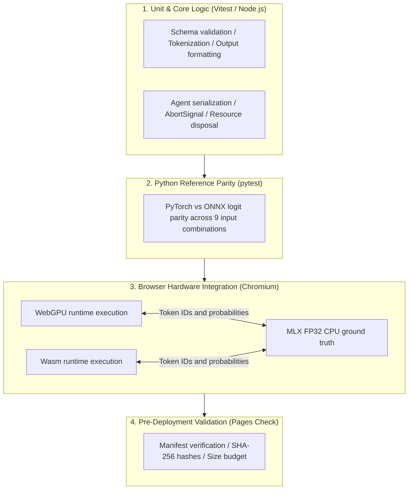

# Validation & Quality Assurance Specification

Test architecture, verification matrices, numerical parity benchmarks, and troubleshooting records for `@r4ai/laya-web`.

## Verification Architecture

Quality assurance spans four distinct layers, moving from isolated core logic to hardware-accelerated browser execution and pre-deployment artifact inspection:



## Verification Matrices

### 1. Core Logic & Agent State Management

| Target | Input Scenario | Expected Behavior | Verification Layer |
| :--- | :--- | :--- | :--- |
| **Question Validation** | Valid `choice`, `score`, and `noul` inputs | Constructs correct prefixes, marker positions, and question type IDs | Core Unit & Model Integration |
| **Invalid Inputs** | Empty choices, duplicate labels, unsupported question types | Rejects inputs before inference dispatch (`predict()` returns rejected Promise) | Core & Agent Unit |
| **Context Truncation** | Prompts exceeding 1,024 tokens | Retains choices and trailing delimiter tags while truncating input text from the end | Core Unit & Model Integration |
| **Context Overflow** | Schemas whose options alone exceed maximum context length | Throws explicit context overflow error | Core Unit |
| **Tokenizer Parity** | Japanese, English, JSON structures, mask tokens, consecutive whitespace | Matches Rust reference tokenizer token IDs and marker offsets exactly | Regression & Parity Tests |
| **Request Serialization** | Concurrent inference calls on a ready agent | Serializes requests sequentially via internal Promise chain | Agent Unit (Mock Driver) |
| **Lifecycle Disposal** | Invoking `dispose()` while inference is in flight | Completes ongoing predictions before releasing runtime resources | Agent Unit |
| **Post-Disposal Safety** | Calling `predict()` or repeated `dispose()` on disposed agent | Rejects new inference calls; guarantees idempotent disposal without throwing | Agent Unit & Browser |

### 2. ONNX Model & In-Browser Inference

| Target | Input Scenario | Expected Behavior | Verification Layer |
| :--- | :--- | :--- | :--- |
| **Numerical Logit Parity** | (Length, options) = (8,2), (19,3), (64,5) across 3 question types | Matches PyTorch prototype outputs within tight numerical tolerance | Python pytest |
| **Hardware Browser Parity** | WebGPU and Wasm execution backends | Matches MLX FP32 CPU reference token IDs, choices, and output probabilities | Browser Test Harness |
| **Streamed Asset Fetching** | Model files served over HTTP | Validates content length headers, allocates single buffer, emits progress events | Local HTTP Integration |
| **Asset Fetch Failures** | HTTP 404, size mismatches, aborted transfers | Cancels active readers, aborts pending requests, cleans up buffers | Local HTTP Integration |

### 3. SolidJS Demo Application Integration

| Target | Input Scenario | Expected Behavior | Verification Layer |
| :--- | :--- | :--- | :--- |
| **Worker Failure Recovery** | Worker initialization or script load failure | Displays error alert in UI and enables retry action | DOM Integration |
| **Concurrent Submit Guard** | Form submission clicked during active inference | Disables button and prevents duplicate execution requests | DOM Integration |
| **Worker Crash Recovery** | Worker terminates via unhandled error event | Terminates crashed worker instance and spawns fresh worker on retry | DOM Integration |
| **Confidence Metric Separation** | Output with 80% choice probability and 41.8% confidence | Renders prediction probability and calibrated confidence in distinct UI elements | DOM Integration |

## Reproduction Procedures

### Local Test Commands

```sh
# 1. Typechecking and JavaScript test suites
pnpm typecheck
pnpm test

# 2. PyTorch vs ONNX logit parity verification (Python)
uv run pytest

# 3. Model baseline validation against MLX FP32 CPU reference
pnpm model:export  # Required if assets are not yet generated
pnpm model:verify

# 4. In-browser hardware validation (WebGPU and Wasm)
pnpm test:browser
# Open the test URL in Chromium and click "Run parity suite"
```

## Test Environment & Baseline Benchmarks

### Environment Specifications

- **Hardware**: Apple M5 (16 GB Unified Memory)
- **Browser**: Chromium with ONNX Runtime Web 1.30.0
- **Reference**: MLX FP32 CPU implementation

### Baseline Quality Metrics

| Scope | Case Count / Metric | Result |
| :--- | :--- | :--- |
| **Python ONNX vs MLX CPU** | 9 / 9 test scenarios | Exact argmax match (maximum absolute logit difference: 0.00183) |
| **Browser WebGPU Inference** | 9 / 9 test scenarios | Identical token IDs, marker positions, and 4-decimal probability parity |
| **Browser Wasm Inference** | 9 / 9 test scenarios | Identical token IDs, marker positions, and 4-decimal probability parity |
| **Unit & HTTP Integration** | All test suites passing | Zero failures, zero skipped tests |
| **V8 Code Coverage (Node.js)** | UI components and core runtime | High statement and branch coverage across all critical modules |

## Technical Findings & Troubleshooting

### 1. Avoiding MLX GPU Precision Deviations (TF32)

- **Root Cause**
  - Default MLX GPU execution applies TensorFloat-32 (TF32) arithmetic for FP32 matrix operations
  - Produces subtle numerical drift compared to true IEEE FP32 outputs
- **Resolution**
  - Set `MLX_ENABLE_TF32=0` or execute the reference model on the MLX CPU backend
  - Guarantees true FP32 precision for parity comparisons

### 2. Metaspace Tokenizer Normalization Patch

- **Root Cause**
  - `@huggingface/tokenizers@0.2.0` ignores the `split: true` configuration in Metaspace pre-tokenizers
  - Unnormalized special tokens are improperly matched against normalized text
- **Resolution**
  - Applied patch via `patches/@huggingface__tokenizers@0.2.0.patch`
  - Bundled with package build to prevent environment inconsistencies

## Pre-Deployment Verification

The `scripts/validate-pages.mjs` script runs during `pnpm build:pages` and in CI workflows to enforce release criteria:

| Check Item | Validation Rule | Action on Failure |
| :--- | :--- | :--- |
| **Required Assets** | Verifies presence of `index.html`, `model.onnx`, `embeddings.f16.bin`, and license files | Aborts CI build and deployment |
| **Model Integrity** | Matches artifact SHA-256 hashes against `config.json` manifest | Rejects corrupted or modified assets |
| **Bundle Size Budget** | Total distribution size must not exceed 1,000,000,000 bytes (1 GB) | Fails deployment if budget is exceeded |
| **ORT Binaries** | Confirms all referenced ONNX Runtime Wasm modules exist in `ort/` | Prevents runtime loader failures |

## Limitations & Scope Boundaries

- **Untested Environments**
  - Safari, Firefox, and mobile operating systems (iOS / Android)
  - Browser memory recovery on low-memory devices lacking WebGPU support
- **Model Output Scope**
  - Verification ensures exported ONNX models match original checkpoint outputs within tolerance (`atol=0.002`, `rtol=0.001`)
  - Domain suitability or factual accuracy of model predictions remains out of scope

## State Machine & Async Asset Fetching

| Current State | Trigger / Event | Next State & Expected Result |
| :--- | :--- | :--- |
| Initial | Submit valid form input | Starts download; hides previous result container |
| Results Present | Re-run submission | Preserves previous result DOM and disclosure state; marks as previous result |
| Re-running | Download & inference progress | Preserves previous result display; blocks duplicate form submissions |
| Re-running | Inference succeeds | Updates result container; clears previous result indicator |
| Results Present | Invalid input submitted | Displays validation error without worker dispatch; retains previous results |
| Re-running | Model asset download fails | Shows error alert; preserves previous results and keeps worker reusable |
| Re-running | Worker error or send failure | Retains previous results; disposes broken worker; spawns new worker on retry |
| Error Present | User corrects input and retries | Re-executes inference while retaining previous result display |
| Any | Component unmounts | Disposes worker and removes event listeners |
| Config Loaded | Asset download starts | Initiates up to 2 concurrent HTTP download streams |
| Downloading | Asset download completes | Fetches next queued asset in vacated slot; maps buffer to file name |
| Downloading | Size mismatch, HTTP error, abort | Aborts active streams; cancels unstarted queue items |
| Downloading | All assets downloaded | Proceeds to model session initialization |
| UI Loading | Multiple file download progress | Aggregates latest downloaded bytes across all files without double counting |
| UI Post-Error | Retry download progress | Resets progress tallies before tracking new download session |

### Asset Loading & Scroll Performance Benchmark

Benchmark comparing sequential asset retrieval against 2-slot parallel retrieval:

| Implementation & Run | Asset Fetch (ms) | Session Init (ms) | Total Load Time (ms) |
| :--- | ---: | ---: | ---: |
| Sequential 1 | 1442.8 | 1205.2 | 2648.0 |
| Sequential 2 | 972.8 | 947.5 | 1920.3 |
| Sequential 3 | 891.7 | 930.6 | 1822.3 |
| Parallel 1 | 1044.7 | 941.1 | 1985.8 |
| Parallel 2 | 904.5 | 909.2 | 1813.7 |
| Parallel 3 | 856.9 | 896.1 | 1753.0 |
| **Sequential Median** | **972.8** | **947.5** | **1920.3** |
| **Parallel Median** | **904.5** | **909.2** | **1813.7** |

Parallel fetching achieved a 7.0% median speedup in asset download and a 5.6% median reduction in total load time, while maintaining identical output classifications, probabilities, and confidence scores across all test runs.

## Regression Test Matrix

| State / Input | Action | Expected Result |
| :--- | :--- | :--- |
| Pending Inference | Caller mutates options and aborts original signal | Aborts at checkpoint; skips inference execution |
| Model Config | Malformed file size or invalid hash format | Rejects manifest prior to downloading files |
| Download | Zero byte expectation but non-empty payload | Rejects transfer on size mismatch |
| Download | Empty body received with positive size expectation | Rejects transfer on size mismatch |
| Download | Empty body received with zero byte expectation | Returns empty Uint8Array |
| Structured Input | Date, Map, Set, or sparse arrays | Rejects invalid JSON data types |
| README Sample | Typecheck against public API exports | Compiles without TypeScript errors |
| Package Docs | Relative links and package.json files array | All links resolve to existing files included in package |

## Related Documents

- [README.md](../README.md): Project overview and client API guide
- [docs/development.md](development.md): Development environment, build steps, and CI/CD workflow
