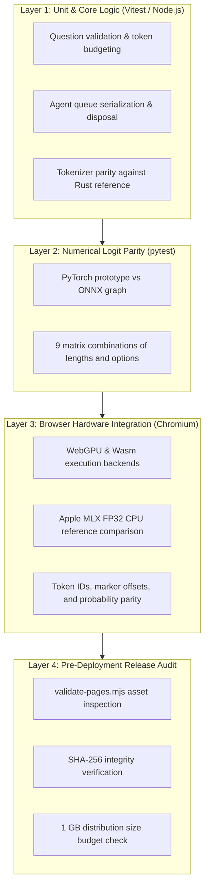

# Validation Specification

Technical specification of testing layers, numerical parity benchmarks, edge-case resolutions, and release criteria for `@r4ai/laya-web`.

---

## Verification Architecture

Quality assurance spans four distinct verification layers, progressing from isolated unit logic to cross-language numerical validation, hardware-accelerated browser execution, and pre-deployment distribution inspection:



---

## Verification Layers

### 1. Unit & Core Logic (Vitest)

- **Input Validation**: Rejects invalid question structures, unsupported question types, empty criteria arrays, and duplicate choice keys before dispatching to the inference engine.
- **Token Budgeting & Truncation**: Enforces the 1,024-token budget. Protects candidate options and delimiter tokens while safely truncating excess state context from the end. Throws `RangeError` if candidate options alone exceed the available budget.
- **Tokenizer Parity**: Validates the JavaScript `@huggingface/tokenizers` wrapper against the native Rust reference tokenizer across multilingual text (English, Japanese), complex JSON structures, mask tokens, and whitespace variations.
- **Request Serialization**: Enforces strictly sequential execution via an internal Promise queue on the `Agent` instance, preventing concurrent GPU memory allocation spikes in browser tabs.
- **Disposal Safety**: Guarantees graceful, idempotent resource release. In-flight predictions complete before the ONNX session is released; subsequent calls to `predict()` reject immediately.

### 2. PyTorch vs ONNX Logit Parity (Python pytest)

The ONNX export is compared directly against the PyTorch reference model across 9 test scenarios varying sequence lengths and option counts:

$$\text{Configurations: } (L, K) \in \{(8, 2), (19, 3), (64, 5)\} \times \{\text{choice}, \text{score}, \text{noul}\}$$

- **Logit Tolerance**: Maximum absolute difference $\le 0.002$ ($\text{atol}=0.002, \text{rtol}=0.001$).
- **Argmax Match**: Predicted top choice must be identical across all test inputs.

### 3. In-Browser Hardware Integration (Chromium WebGPU / Wasm)

The browser test harness verifies client-side execution directly within Chromium against an Apple MLX FP32 CPU reference implementation:

- Evaluates identical prompt scenarios across both WebGPU and Wasm execution backends.
- Verifies exact matching of token IDs, special marker positions, and output probabilities (matching to 4 decimal places).

### 4. Pre-Deployment Integrity Audit (`validate-pages.mjs`)

Executed during `pnpm build:pages` and in automated CI pipelines:

- Verifies that all required files (`index.html`, `model.onnx`, `embeddings.f16.bin`, and runtime binaries) exist and are non-empty.
- Recomputes SHA-256 hashes of all model assets and compares them against `config.json`.
- Enforces an upper limit of 1,000,000,000 bytes (1 GB) for the total deployed site.
- Verifies that all ONNX Runtime Web Wasm and worker modules referenced by compiled JavaScript are present in `ort/`.

---

## Numerical Accuracy & Ground Truth

### Baseline Environment

- **Hardware**: Apple M5 (16 GB Unified Memory)
- **Browser**: Chromium with ONNX Runtime Web 1.30.0
- **Reference**: Apple MLX FP32 CPU reference implementation

### Baseline Parity Results

| Target Scope                 | Test Cases      | Validation Result                                                       |
| :--------------------------- | :-------------- | :---------------------------------------------------------------------- |
| **Python ONNX vs MLX CPU**   | 9 / 9 scenarios | Identical argmax (maximum absolute logit difference: 0.00183)           |
| **Browser WebGPU Inference** | 9 / 9 scenarios | Identical token IDs, marker positions, and 4-decimal probability parity |
| **Browser Wasm Inference**   | 9 / 9 scenarios | Identical token IDs, marker positions, and 4-decimal probability parity |
| **Unit & Integration Tests** | 86 / 86 tests   | 100% passing across all suites                                          |

### Avoiding MLX GPU Precision Drift (TF32)

By default, Apple MLX GPU execution uses TensorFloat-32 (TF32) math for FP32 matrix multiplications, which can introduce minor numerical divergence from standard IEEE 754 FP32.

When generating ground-truth comparison values with [`scripts/verify_model.py`](../scripts/verify_model.py), the script sets `MLX_ENABLE_TF32=0` and executes on the MLX CPU backend to guarantee true FP32 mathematical parity.

---

## Critical Engineering Findings & Edge Cases

### 1. Metaspace Tokenizer Normalization Patch

- **Issue**: `@huggingface/tokenizers@0.2.0` ignores the `split: true` configuration in Metaspace pre-tokenizers, causing unnormalized special tokens to be incorrectly matched against normalized text.
- **Resolution**: Applied a targeted patch in [`patches/@huggingface__tokenizers@0.2.0.patch`](../patches/@huggingface__tokenizers@0.2.0.patch) to ensure tokenization parity with Hugging Face's Python and Rust implementations.

### 2. WebGPU Storage Buffer Limits & CPU-Bound Embedding Slicing

- **Issue**: Modern multilingual models (like ModernBERT) use large vocabularies (>128,000 tokens). At 768 hidden dimensions, a full FP32 embedding matrix requires ~393 MB, exceeding browser WebGPU storage buffer binding limits (commonly 128 MB or 256 MB depending on device and driver).
- **Resolution**: `@r4ai/laya-web` stores raw FP16 embeddings (`embeddings.f16.bin`, ~248 MB) in CPU memory. During inference, only the active input token vectors are sliced, converted from FP16 to FP32 on the CPU, and fed directly as a compact tensor into the ONNX graph.

### 3. Context Budgeting & Token Window Allocation

The model operates within a 1,024-token maximum window:

```
[CLS] + [Instruction Head] + [SEP] + [Option Markers] + [SEP] + [State Context] + [SEP]
```

- Candidate options are allocated a reserved token budget to prevent option truncation.
- If the instruction head and options consume most of the budget, input state context is truncated from the right.
- If options alone exceed the token budget, the runtime rejects the call early with an explicit `RangeError`.

---

## Asset Streaming & Download Performance

The runtime downloads model assets using a 2-slot concurrent worker pool ([`src/assets.ts`](../src/assets.ts)). Pre-allocating a single `Uint8Array` based on expected byte counts eliminates intermediate chunk buffering and reduces memory churn.

### Sequential vs. 2-Slot Parallel Download Benchmark

| Method & Run          | Asset Fetch (ms) | Session Init (ms) | Total Load Time (ms) |
| :-------------------- | ---------------: | ----------------: | -------------------: |
| Sequential 1          |           1442.8 |            1205.2 |               2648.0 |
| Sequential 2          |            972.8 |             947.5 |               1920.3 |
| Sequential 3          |            891.7 |             930.6 |               1822.3 |
| Parallel 1            |           1044.7 |             941.1 |               1985.8 |
| Parallel 2            |            904.5 |             909.2 |               1813.7 |
| Parallel 3            |            856.9 |             896.1 |               1753.0 |
| **Sequential Median** |        **972.8** |         **947.5** |           **1920.3** |
| **Parallel Median**   |        **904.5** |         **909.2** |           **1813.7** |

Parallel fetching achieves a **7.0% median speedup** in asset download and a **5.6% median reduction** in total initialization time while producing identical numerical outputs across all runs.

---

## Test Execution Commands

```sh
# 1. Typecheck and run all TypeScript unit tests
pnpm typecheck
pnpm test

# 2. Verify PyTorch vs ONNX logit parity (Python)
uv run pytest

# 3. Benchmark exported model against MLX FP32 CPU reference (Apple Silicon)
pnpm model:verify

# 4. Run browser hardware validation (WebGPU and Wasm)
pnpm test:browser
# Open the test URL in Chromium and run the parity suite

# 5. Validate distribution assets and bundle size budget
pnpm build:pages
```

---

## Related Documents

- [README.md](../README.md): Project overview, architecture, and quickstart guide.
- [Development Guide](development.md): Environment setup, build commands, and CI/CD pipelines.
