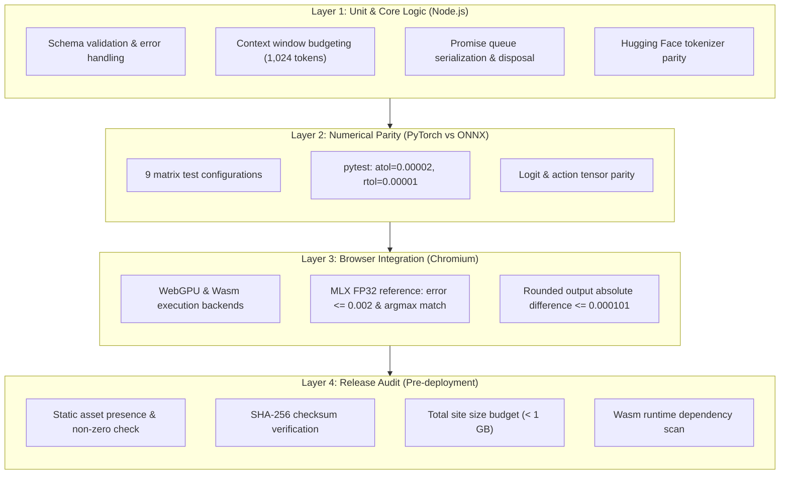

# Validation Specification

Technical specification of testing layers, numerical parity benchmarks, edge-case resolutions, and release criteria for `@r4ai/laya-web`.

## Verification Architecture

Quality assurance spans four distinct verification layers, progressing from isolated unit logic to cross-language numerical validation, hardware-accelerated browser execution, and pre-deployment release auditing:



## Verification Layers

### Layer 1: Unit & Core Logic (Vitest)

- **Input Validation**
  - Rejects invalid question structures and unsupported types
  - Validates criteria arrays for non-emptiness and unique choice labels
- **Token Budgeting & Truncation**
  - Enforces the 1,024-token budget
  - Limits option texts to 48 tokens and preserves option markers while truncating excess state context from the right
  - Throws `RangeError` if candidate options and structural delimiters exceed the budget
- **Tokenizer Parity**
  - Matches the JavaScript `@huggingface/tokenizers` wrapper against the native Rust reference
  - Validated across multilingual text, complex JSON, mask tokens, and whitespace variations
- **Request Serialization**
  - Serializes calls via an internal Promise queue on each `Agent` instance
  - Prevents concurrent GPU memory allocation spikes in browser tabs
- **Resource Disposal**
  - Guarantees graceful, idempotent resource cleanup
  - In-flight predictions complete before the ONNX session is released
  - Subsequent calls to `predict()` reject immediately

### Layer 2: PyTorch vs ONNX Logit Parity (pytest)

The ONNX export is compared directly against the PyTorch reference model across 9 test configurations varying sequence lengths and question types:

$$\text{Configurations: } (L, K) \in \{(8, 2), (19, 3), (64, 5)\} \times \{\text{choice}, \text{score}, \text{noul}\}$$

- **Numerical Tolerance**: Verifies both logits and action predictions match PyTorch within $\text{atol}=2\times 10^{-5}$ ($0.00002$) and $\text{rtol}=1\times 10^{-5}$ ($0.00001$)

### Layer 3: Browser Hardware Integration (Chromium WebGPU / Wasm)

The browser test harness verifies client-side execution directly within Chromium against an Apple MLX FP32 CPU reference implementation:

- Evaluates identical prompt scenarios across both WebGPU and Wasm execution backends
- Verifies exact matching of token IDs and special marker positions
- Verifies that absolute differences between 4-decimal rounded numeric outputs (`probabilities`, `score`, `noul`, `confidence`) remain within $\le 0.000101$
- Verifies idempotent disposal lifecycle and reject-after-dispose behavior

### Layer 4: Pre-Deployment Integrity Audit (`validate-pages.mjs`)

Executed during `pnpm build:pages` and in automated CI pipelines:

- Verifies that all required files (`index.html`, `model.onnx`, `embeddings.f16.bin`, and runtime binaries) exist and are non-empty
- Recomputes SHA-256 hashes of all model assets and compares them against `config.json`
- Enforces an upper limit of 1,000,000,000 bytes (1 GB) for the total deployed site
- Verifies that all ONNX Runtime Web Wasm and worker modules referenced by compiled JavaScript are present in `ort/`

## Numerical Accuracy & Ground Truth

### Baseline Environment

- **Hardware**: Apple M5 (16 GB Unified Memory)
- **Browser**: Chromium with ONNX Runtime Web 1.30.0
- **Reference**: Apple MLX FP32 CPU reference implementation

### Baseline Parity Results

| Target Scope                 | Test Cases      | Validation Result                                                                       |
| :--------------------------- | :-------------- | :-------------------------------------------------------------------------------------- |
| **Python ONNX vs MLX CPU**   | 9 / 9 scenarios | Identical argmax (maximum absolute logit difference: 0.00183)                           |
| **Browser WebGPU Inference** | 9 / 9 scenarios | Exact token IDs and marker positions; rounded output absolute difference $\le 0.000101$ |
| **Browser Wasm Inference**   | 9 / 9 scenarios | Exact token IDs and marker positions; rounded output absolute difference $\le 0.000101$ |
| **Unit & Integration Tests** | 86 / 86 tests   | 100% passing across all suites                                                          |

### Avoiding MLX GPU Precision Drift (TF32)

By default, Apple MLX GPU execution uses TensorFloat-32 (TF32) math for FP32 matrix multiplications, which introduces minor numerical divergence from standard IEEE 754 FP32.

When generating ground-truth comparison values with [`scripts/verify_model.py`](https://github.com/r4ai/laya-web/blob/main/scripts/verify_model.py), the script explicitly specifies `device="cpu"` to execute on the MLX CPU backend, bypassing GPU TF32 math to guarantee standard IEEE 754 FP32 parity.

## Critical Engineering Findings & Edge Cases

### 1. Metaspace Tokenizer Normalization Patch

- **Issue**: `@huggingface/tokenizers@0.2.0` ignores the `split: true` configuration in Metaspace pre-tokenizers, causing unnormalized special tokens to be incorrectly matched against normalized text
- **Resolution**: Applied a targeted patch in [`patches/@huggingface__tokenizers@0.2.0.patch`](https://github.com/r4ai/laya-web/blob/main/patches/@huggingface__tokenizers@0.2.0.patch) to ensure tokenization parity with Hugging Face's Python and Rust implementations

### 2. WebGPU Storage Buffer Limits & CPU-Bound Embedding Slicing

- **Issue**: Modern multilingual models use large vocabularies (256,000 tokens). At 768 hidden dimensions, a full FP32 embedding matrix requires ~786 MB, exceeding browser WebGPU storage buffer binding limits (commonly 128 MB or 256 MB depending on device and driver)
- **Resolution**: `@r4ai/laya-web` stores raw FP16 embeddings (`embeddings.f16.bin`, ~393.22 MB) in CPU memory. During inference, only the active input token vectors are sliced, converted from FP16 to FP32 on the CPU, and fed directly as a compact tensor into the ONNX graph

### 3. Context Budgeting & Token Window Allocation

The model operates within a 1,024-token maximum window:

```
[CLS] + [Instruction Head] + [SEP] + [Option Markers] + [SEP] + [State Context] + [SEP]
```

- Candidate option texts are initially limited to 48 tokens each and shortened further if the head budget is constrained, preserving option markers and candidates
- State context is truncated from the right to fit the remaining token budget
- If candidate options and structural delimiters alone exceed the 1,024-token window, the runtime rejects early with a `RangeError`

## Asset Streaming & Download Performance

The runtime downloads model assets using a 2-slot concurrent worker pool ([`src/assets.ts`](https://github.com/r4ai/laya-web/blob/main/src/assets.ts)). Pre-allocating a single `Uint8Array` based on expected byte counts eliminates intermediate chunk buffering and reduces memory churn.

### Sequential vs. 2-Slot Parallel Download Benchmark

| Method & Run          | Asset Fetch (ms) | Session Init (ms) | Total Load Time (ms) |
| :-------------------- | ---------------: | ----------------: | -------------------: |
| Sequential 1          |           1442.8 |            1205.2 |               2648.0 |
| Sequential 2          |            972.8 |             947.5 |               1920.3 |
| Sequential 3          |            891.7 |             930.6 |               1822.3 |
| Parallel 1            |           1044.7 |             941.1 |               1985.8 |
| Parallel 2            |            904.5 |             909.2 |               1813.7 |
| Parallel 3            |            856.9 |             896.1 |               1753.0 |
| **Sequential Median** |        **972.8** |         **947.5** |           **1920.3** |
| **Parallel Median**   |        **904.5** |         **909.2** |           **1813.7** |

Parallel fetching achieves a **7.0% median speedup** in asset download and a **5.6% median reduction** in total initialization time while producing identical numerical outputs across all runs.

## Test Execution Commands

```sh
# 1. Typecheck and run all TypeScript unit tests
pnpm typecheck
pnpm test

# 2. Verify PyTorch vs ONNX logit parity (Python)
uv run pytest

# 3. Benchmark exported model against MLX FP32 CPU reference (Apple Silicon)
# Generates examples/minimal/public/models/laya/parity.json required for browser testing
pnpm model:verify

# 4. Run browser hardware validation (WebGPU and Wasm)
# Starts local harness on http://127.0.0.1:5174/ (requires parity.json; select backend and run)
pnpm test:browser

# 5. Validate distribution assets and bundle size budget
pnpm build:pages
```

## Related Documents

- [README.md](../README.md): Project overview, architecture, and quickstart guide
- [Development Guide](development.md): Environment setup, build commands, and CI/CD pipelines

## Node.js runtime

`pnpm test:node` builds and exercises the public package import with a tiny committed ONNX model, including external weights. The fixture generator is `tests/fixtures/node-model/generate.py`; regenerate it with `.venv/bin/python tests/fixtures/node-model/generate.py` after installing the Python project dependencies. No model download is required for CI.

| Initial state / input                              | Transition       | Expected result                              |
| -------------------------------------------------- | ---------------- | -------------------------------------------- |
| Local relative/absolute directory or file URL      | load             | WASM agent, validated bytes, progress events |
| HTTP model URL                                     | load             | Same agent and inference results             |
| Default or auto backend in Node.js                 | initialize       | WASM, no WebGPU fallback event               |
| Explicit WebGPU / unknown backend                  | load             | Reject before reading model assets           |
| Missing file or size mismatch (short, long, empty) | read             | Reject, cancel remaining batch reads         |
| Aborted signal before/during file read             | read             | Reject and release streams                   |
| Ready agent, choice/score/noul/single choice       | predict          | Expected probabilities and action output     |
| Ready agent                                        | repeated predict | Same result                                  |
| Ready agent                                        | dispose twice    | Resources released, second call safe         |
| Disposed agent                                     | predict          | Reject                                       |

`pnpm model:verify:node` additionally loads the full exported checkpoint and compares all nine reference questions against `parity.json`, including usage and rounded probabilities (absolute tolerance `0.000101`). It fails if assets are absent; it does not silently skip validation.
